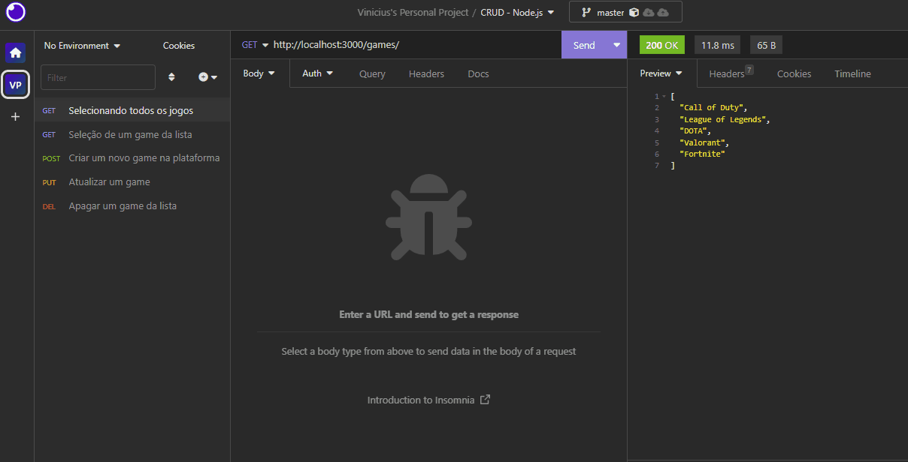

<h1 align="center"> 🎮 Lista de Games </h1>
 

  <a href="#-projeto">Sobre o projeto</a>&nbsp;&nbsp;&nbsp;|&nbsp;&nbsp;&nbsp;
  <a href="#-tecnologias">Tecnologias</a>&nbsp;&nbsp;&nbsp;|&nbsp;&nbsp;&nbsp;
  <a href="#-aprendizados">Aprendizados</a>&nbsp;&nbsp;&nbsp;|&nbsp;&nbsp;&nbsp;
  <a href="#-contato">Contato</a>&nbsp;&nbsp;&nbsp;&nbsp;&nbsp;&nbsp;

 

## 💻 Projeto

Esse projeto trata-se de um CRUD simples de uma lista que contém alguns jogos, feito com <b>Node.js</b> e utilizando o <b>Insomnia</b> para alterações na base de dados.

Você pode ver algumas imagens do projeto no <b>GIF</b> abaixo, utilizando o Insomnia para adição, exclusão, alteração e visualização de elementos na base de dados.
  

  

 

## 🚀 Tecnologias

- JavaScript (Node.js)
- Git e Github
  

## 🏆 Aprendizados

Esse projeto foi importante por me proporcionar usar os conteúdos aprendidos durante meus estudos em Node.js.  
Pude aplicar boa parte do conteúdo que vi nos módulos inicias do curso e também usar o Insomnia pela primeira vez, para fazer a visualização e alterações nas bases de dados do projeto.
   

  <h2>👋 <u>Contato</u></h2>
  <h3 align="left">Obrigado pela sua visita! Estou aberto à sugestões e feedbacks =)</h3> 
  
  

 

